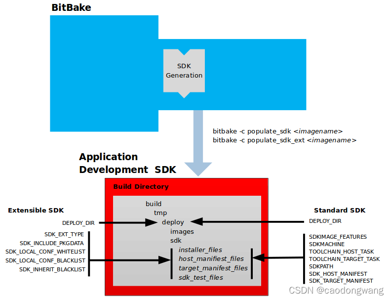

## 构建SDK及添加工具链

### 为什么使用SDK

我们每次都把自己的code放到yocto环境中去编译的话，我们就需要搭建yocto的编译环境，这需要耗费大量的时间，有没有可能我们可以通过别人提供的SDK直接开发自己的软件包呢？yocto为我们提供了这个生成SDK的方法。



### 编译生成SDK

```shell
bitbake core-image-tiny -c do_populate_sdk
```
执行这条命令将会生成sdk安装脚本，整个过程需要耗费较长时间，耐心等待，如果我们的需要的环境是x86，我们将可以在`build/tmp/deploy/sdk`找到自解压的后缀是sh的文件，
```shell
$ ls build/tmp/deploy/sdk
xxxxx-toolchain-4.0.4.host.manifest
xxxxx-toolchain-4.0.4.sh
xxxxx-toolchain-4.0.4.target.manifest
xxxxx-toolchain-4.0.4.testdata.json
```
直接执行就可以安装了
rpi的sdk如下：
```shell
❯  ls build/tmp/deploy/sdk
poky-glibc-x86_64-py3qt-image-cortexa7t2hf-neon-vfpv4-raspberrypi3-toolchain-3.1.20.host.manifest
poky-glibc-x86_64-py3qt-image-cortexa7t2hf-neon-vfpv4-raspberrypi3-toolchain-3.1.20.sh
poky-glibc-x86_64-py3qt-image-cortexa7t2hf-neon-vfpv4-raspberrypi3-toolchain-3.1.20.target.manifest
poky-glibc-x86_64-py3qt-image-cortexa7t2hf-neon-vfpv4-raspberrypi3-toolchain-3.1.20.testdata.json
```  
### 安装SDK

```shell
$ ./xxxxx-toolchain-4.0.4.sh
Poky (Yocto Project Reference Distro) SDK installer version 4.0.4
=================================================================
Enter target directory for SDK (default: /opt/poky/4.0.4):
You are about to install the SDK to "/opt/poky/4.0.4". Proceed [Y/n]? y
[sudo] password for zhp:
Extracting SDK...........................................done
Setting it up...done
SDK has been successfully set up and is ready to be used.
Each time you wish to use the SDK in a new shell session, you need to source the environment setup script e.g.
 $ . /opt/poky/4.0.4/environment-setup-corei7-64-poky-linux
```
### 使用SDK
如需使用，执行`. /opt/poky/4.0.4/environment-setup-corei7-64-poky-linux`即可。很显然每次打开终端都需要重新执行上述操作。

### 测试环境
```shell
# 本地环境编译c
$ make a
cc     a.c   -o a
$ file a
a: ELF 64-bit LSB shared object, x86-64, version 1 (SYSV), dynamically linked, interpreter /lib64/ld-linux-x86-64.so.2, BuildID[sha1]=940e4034d5e7353cd35ed7ee12f355a0de0e0eb6, for GNU/Linux 3.2.0, not stripped
# SDK编译c
$ . /opt/poky/4.0.4/environment-setup-corei7-64-poky-linux
$ rm a
$ make a
x86_64-poky-linux-gcc  -m64 -march=nehalem -mtune=generic -mfpmath=sse -msse4.2 -fstack-protector-strong  -O2 -D_FORTIFY_SOURCE=2 -Wformat -Wformat-security -Werror=format-security --sysroot=/opt/poky/4.0.4/sysroots/corei7-64-poky-linux  -O2 -pipe -g -feliminate-unused-debug-types   -Wl,-O1 -Wl,--hash-style=gnu -Wl,--as-needed  -Wl,-z,relro,-z,now  a.c   -o a
$ file a
a: ELF 64-bit LSB pie executable, x86-64, version 1 (SYSV), dynamically linked, interpreter /lib/ld-linux-x86-64.so.2, BuildID[sha1]=02195827f2065111c697cf57061635b6371e6d3d, for GNU/Linux 3.2.0, with debug_info, not stripped
```
使用SDK交叉编译环境之后会直接替换本地编译环境

### 目标机器上安装SDK
有时我们想要在目标设备上编译调试程序怎么办？  
临时方法：在build/conf/local.conf添加
```shell
	EXTRA_IMAGE_FEATURES += "tools-sdk"
```
更好的方法是添加到image中

如`poky/meta/recipes-sato/images/core-image-sato-sdk.bb`中是这样描述的
```shell
IMAGE_FEATURES += "tools-sdk"
```